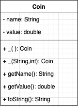

# Return Ready Lab 07

* Part A - Foundations 2.3
* Part B - Foundations 3.1
* Part C - Instructor Challenge


## Part A

Below is the UML for the `Robot` class:


Given the following code in `RobotTester` :

```
public static void main(String[] args) {
    Robot robot01 = new Robot();
    System.out.println("Robot 1 My name is " + robot01.getName());
    System.out.println("Robot 1 My Phrase is " + robot01.getPhrase());

    Robot robot02 = new Robot("R2D2", "Beep Bop Boop Skettle Dee Wop");
    System.out.println("Robot 2 My Name is " + robot02.getName());
    System.out.println("Robot 2 My Phrase is " + robot02.getPhrase());
}
    
```

If your code is working correcly should output :

```
Robot 1 My name is Name is not set
Robot 1 My Phrase is Phrase is not set
Robot 2 My Name is R2D2
Robot 2 My Phrase is Beep Bop Boop Skettle Dee Wop
```

## Part B

In the file `Variables02a` :

RUN THE PROGRAM BETWEEN EACH STEP AND OBSERVE THE OUTPUT

1.  Change the print statements in lines 12 and 16 so that they print the value of x.
2. Change the value of x to "kitty".

In the file `Variables02b`:

* Comment each line of code
* Review with class

In the file `Variables03`:

Add the following code, and fix all the errors:

```
public static void main(String[] args) {

    boolean bool = true;

    int intVar1 = true;
    int intVar2 = 2;
    intVar3 = 3;

    double doubleVar1, doubleVar2, doubleVar3, doubleVar4;
    doubleVar1 = 1.1;
    doublevAr2 = 2.1;
    double doubleVar3 = 3.1;


    String stringVar1 = 1;
    String stringVar2 = "2";

    //Don't edit these print statements
    System.out.println("bool = "        +bool);
    System.out.println("intVar1 = "     +intVar1);
    System.out.println("intVar2 = "     +intVar2);
    System.out.println("intVar3 = "     +intVar3);
    System.out.println("doubleVar1 = "  +doubleVar1);
    System.out.println("doubleVar2 = "  +doubleVar2);
    System.out.println("doubleVar3 = "  +doubleVar3);
    System.out.println("doubleVar4 = "  +doubleVar4);
    System.out.println("stringVar1 = "  +(stringVar1 +1));
    System.out.println("stringVar2 = "  +(stringVar2 +2));
}

```


## Part C
Previously you did the activity for a coin sorter. Let's take that activity a little further. 

In the `part_c` package complete the `Coin` class using the UML diagram below:



> One thing to notice is that once there are only Getter methods and no Setters. The reason for this, is you do not want a coin changing value after its created. By not creating setters, the Coin is no an immutable object, just like Strings.

Let's now test to see if the class is completed correctly.

Add the following code to the `Main` in the `part_a.activity01_coin` package

```
public static void main(String[] args) {
    Coin coin1 = new Coin();
    Coin coin2 = new Coin("Quarter", .25);
    Coin coin3 = new Coin("Dime", .10);
    Coin coin4 = new Coin("Penny", .01);
    System.out.println(coin1);
    System.out.println(coin2);
    System.out.println(coin3);
    System.out.println(coin4);
}
``` 

The code you wrote is correct if you can see the following output when you run `Main`:

```
Coin{name='Penny', value=0.01}
Coin{name='Quarter', value=0.25}
Coin{name='Dime', value=0.1}
Coin{name='Penny', value=0.01}
```

Lets go back to `part_c` package complete the `Coin` class using the UML diagram below:


In Part A you completed the `Coin` class.


The objective in Part C is given a group of coins with random values, it will place them in a array from smallest value to greatest.

For example Given these coins:

```
Coin coin1 = new Coin();
Coin coin2 = new Coin("Quarter", .25);
Coin coin3 = new Coin("Dime", .10);
Coin coin4 = new Coin("Quarter", .25);
Coin coin5 = new Coin("Penny", .01);

```

The array would look like such:

| 0 | 1 | 2 | 3 | 4 | 
|---|---|---|---|---|
| Penny | Penny | Dime | Quarter | Quarter |

When displayed to the user it should look like :

```
Your have: 2 Penny coin, 1 Dime coin, 2 Qurater coin
```

Use this template for a [Sprial Requirements Chart](./src/main/java/com/codedifferently/labs/lab07/part_c/documents/SprialRequirementsTemplate.docx). When you complete the document, save it in the same folder so can be included in your git repo.

Use this template for a [Properties and Behaviors Table](./src/main/java/com/codedifferently/labs/lab07/part_c/documents/PropsAndBehaviorsTable.docx). Complete this for any objects you need to create to complete the program.

**Now Get approval from your instructor before proceeding.**

Once approved , complete the assignment.

Happy Coding!!!

